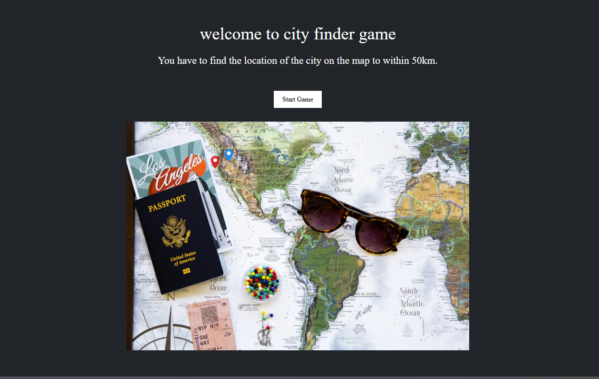

# European City Finder Game

## Overview

The European City Finder Game is a web-based interactive game where players must locate European cities on an unmarked map. The player's task is to place a pin as close as possible to the actual location of the given city. The game is developed using React.js and Next.js with TypeScript for type safety and better developer experience.



website is deployed at https://neovo-tech-assesment.vercel.app/

## Game Description

Upon starting the game, the player sees a map of Europe without any streets or city labels, only country borders. The player will be prompted with a city name and must place a pin on the map where they believe the city is located. After placing the pin, the game will reveal the actual location of the city and calculate the distance between the player's pin and the real city in kilometers. If the distance is within 50km, it is considered a correct selection.

### Game Logic

- Players start with a score of 1500 kilometers.
- Each round, the distance between the guessed position and the actual city location is subtracted from the player's score.
- The game ends when the player's score reaches zero.
- The high score is determined by the number of cities the player successfully identified.

## JSON Data

The cities and their respective coordinates are provided in a JSON format:

```json
{
  "cities": [
    {
      "name": "Amsterdam",
      "position": { "lat": 52.370216, "lng": 4.895168 }
    },
    {
      "name": "Rome",
      "position": { "lat": 41.902783, "lng": 12.496366 }
    },
    {
      "name": "Helsinki",
      "position": { "lat": 60.169856, "lng": 24.938379 }
    },
    {
      "name": "Stockholm",
      "position": { "lat": 59.329323, "lng": 18.068581 }
    },
    {
      "name": "London",
      "position": { "lat": 51.507351, "lng": -0.127758 }
    },
    {
      "name": "Oslo",
      "position": { "lat": 59.913869, "lng": 10.752245 }
    },
    {
      "name": "Paris",
      "position": { "lat": 48.856614, "lng": 2.352222 }
    },
    {
      "name": "Vienna",
      "position": { "lat": 48.208174, "lng": 16.373819 }
    },
    {
      "name": "Budapest",
      "position": { "lat": 47.497912, "lng": 19.040235 }
    }
  ]
}
```

## Installation

1. Clone the repository:
   ```sh
   git clone https://github.com/Moinulilm10/NeovoTech-Assesment.git
   cd NeovoTech-Assesment
   ```
2. Install dependencies:

   ```sh
   npm install
   ```

3. Run the development server:

   ```sh
   npm run dev
   ```

4. Open [http://localhost:3000](http://localhost:3000) in your browser to see the game.

## Technologies Used

- **React.js**: For building the user interface.
- **Next.js**: For server-side rendering and easy routing.
- **TypeScript**: For static type checking and improved code quality.
- **Leaflet.js**: For interactive maps.
- **Geolib**: For distance calculations between geographical points.

## Features

- Interactive map with pin placement.
- Distance calculation between guessed and actual locations.
- Score tracking based on distance accuracy.
- User-friendly interface with clear game instructions.

## Improvements

To enhance the game further, the following improvements are suggested:

- **Leader board**: Add a leader board to track high scores globally.
- **Additional Cities**: Expand the list of cities to increase the game's difficulty and variety.
- **Hints**: Provide hints to players to make the game more engaging.
- **Multiplayer Mode**: Introduce a multiplayer mode for competitive play.
- **Animations**: Add animations for pin placement and score updates to improve the user experience.

## Contributing

Contributions are welcome! Please feel free to submit a Pull Request or open an issue to discuss any changes.

## Acknowledgements

- The map visualization is powered by Leaflet.js.
- Distance calculations are performed using Geolib.

```

```
